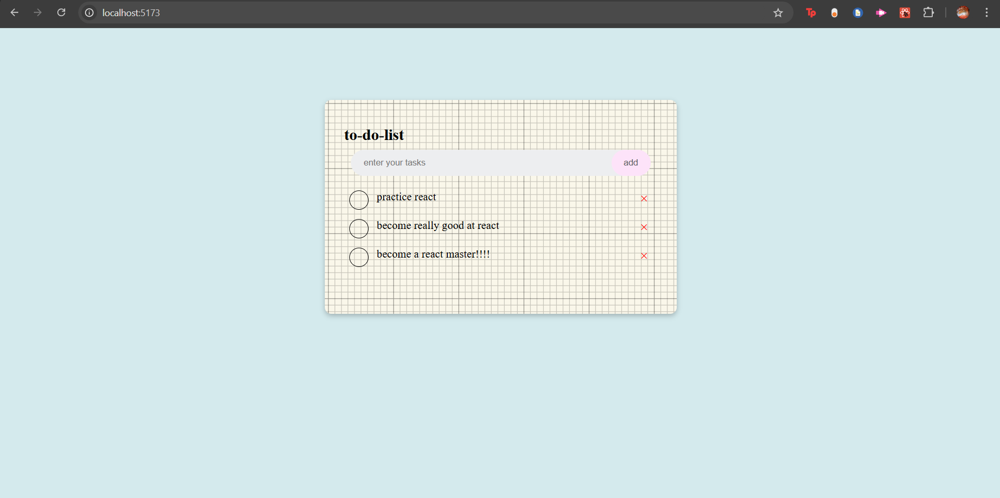

# To-do-List-React

## Description

I built this project to get back into the basics of react, and refamiliarise myself with the foundational concepts.

# Challenges:

- I forgot that when you are calling a function with an argument (ie. toggleTask(index) ) in response to an event (ie. onChange{}, onSubmit{}, onClick{} etc.) in react you need to make sure you prefix it with "()=>" to ensure the function isnt called immediately upon render. Like this: **"onClick={() => toggleTask(index)}"**

- Making it so that only the task li element that was _clicked_ gets the "checked" className added to it, and subsequently the "checked" CSS styling, was a big challenge. The way I got over that was by:

  1. Making each task in the _"tasks"_ state array an object like this:
     **setTasks([...tasks, { text: newTask, completed: false }]);** (newTask = the state holding the input value)
     Instead of each task being a string. So, the _"tasks"_ array is now an array of task objects, not an array of task strings. The completed key was added to enable the toggling of the "checked"/"unchecked" CSS className.
     _this occurs in the addTask() function_
  2. The toggleTaks() function takes one argument: "index" which is (the index/key) passed in from the li element that triggers an onClick event.
     The toggleTasks() array then maps through the array of task objects ("tasks") and checks, via ternary operator, if the index of the clicked li element is equal to the index(i) of the current task object in the task array. If yes, we will need to transform this task object by updating its "completed" value to be the opposite of its initial value (ie toggle). If the index is not the same then we dont alter the current task object we leave it be.
     This is then save this under the updatedTasks variable. This variable is what we use to update the "tasks" array - setTasks()
     **const toggleTask = (index) => {**
     **const updatedTasks = tasks.map((task, i) =>**
     **i === index ? { ...task, completed: !task.completed } : task**
     **);**
     **setTasks(updatedTasks);**
     **};**

  3. Lastly we use conditional rendering in the classname of the li elements, so it checks if each task objects's "completed" value is true, if yes, it gets the "checked" className, else it will have the "unchecked" className:
     **className={task.completed ? "checked" : "unchecked"}**
     **onClick={() => toggleTask(index)}**

- Lastly i had an issue saving my tasks to local storage. So initially when i would reload, my array saved under the "tasks-react" local storage key would empty upon page reload.
  The issue was that "tasks" was initially an empty array, which was saved to localStorage before loading the stored data, thus overwriting it. The loaded flag i used prevents this by ensuring localStorage is only updated _after_ the data has loaded.

## Application:

